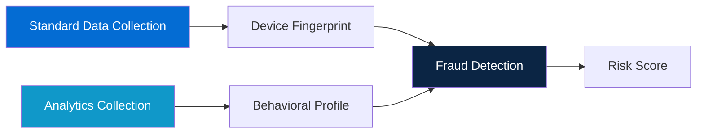

Analytics collection is an optional feature that captures user interface interactions and behavioral patterns within your app. This additional data layer helps Kount detect sophisticated fraud attacks that rely on automated bots or unusual user behavior.

<Info>
Analytics collection was introduced in version 4.1.0 and is **enabled by default**. You can disable it at any time if it doesn't fit your use case.
</Info>

## What is Analytics Collection?

While standard data collection gathers device information (hardware, software, network), analytics collection focuses on **how users interact** with your app:

- Screen transitions and navigation patterns
- UI element interactions (taps, swipes, form fills)
- Timing metrics (time spent on screens)
- User behavior patterns



<Note>
Analytics data is **anonymous** and doesn't capture specific content like text you type, images you view, or sensitive information. It only captures interaction patterns.
</Note>

## Why Use Analytics?

Analytics collection helps detect fraud patterns that device data alone might miss:

<CardGroup cols={2}>
  <Card title="Bot Detection" icon="robot">
    Automated bots interact with apps differently than humans. Analytics can identify unnatural click patterns, superhuman speeds, and scripted behaviors.
  </Card>
  
  <Card title="Account Takeover Prevention" icon="user-lock">
    Legitimate users have consistent behavioral patterns. Sudden changes in navigation or interaction style may indicate account compromise.
  </Card>
  
  <Card title="Fraud Ring Identification" icon="users">
    Fraudsters often use similar attack patterns. Analytics helps identify groups of users exhibiting identical behaviors.
  </Card>
  
  <Card title="Enhanced Risk Scoring" icon="scale-balanced">
    Combining device data with behavioral data provides more accurate risk assessments, reducing false positives and false negatives.
  </Card>
</CardGroup>

## What Data is Collected?

Analytics collection captures UI interactions without recording specific content:

### Activity Lifecycle Events

```kotlin
// These events are automatically tracked:
- Activity created
- Activity started
- Activity resumed
- Activity paused
- Activity stopped
- Activity destroyed
```

This helps Kount understand:
- How long users spend on each screen
- Navigation patterns through your app
- Whether behaviors match typical user flows

### UI Interaction Patterns

Starting with version 4.1.0, the SDK tracks:

- **View interactions**: Buttons clicked, switches toggled, etc.
- **Scroll behavior**: Scrolling speed and patterns
- **Form interactions**: Fields focused (but not content typed)
- **Gesture patterns**: Tap, swipe, and pinch behaviors

<Warning>
**What is NOT collected**:
- Text entered in forms
- Images or media viewed
- Specific content displayed
- Passwords or sensitive data
- Anything behind authentication
</Warning>

## Enabling and Disabling Analytics

Analytics collection is controlled with a single method:

### Enable Analytics (Default)

```kotlin
import com.kount.api.KountSDK

class MainActivity : AppCompatActivity() {
    override fun onCreate(savedInstanceState: Bundle?) {
        super.onCreate(savedInstanceState)
        
        KountSDK.setMerchantId("999999")
        KountSDK.setEnvironment(KountSDK.ENVIRONMENT_TEST)
        
        // Enable analytics collection
        KountSDK.setCollectAnalytics(true)
    }
}
```

### Disable Analytics

```kotlin
class MainActivity : AppCompatActivity() {
    override fun onCreate(savedInstanceState: Bundle?) {
        super.onCreate(savedInstanceState)
        
        KountSDK.setMerchantId("999999")
        KountSDK.setEnvironment(KountSDK.ENVIRONMENT_TEST)
        
        // Disable analytics collection
        KountSDK.setCollectAnalytics(false)
    }
}
```

<Tip>
**Configuration tip**: Set analytics preference **before** calling `collectForSession()` for the first time. Changes take effect immediately, but won't affect already-started collection.
</Tip>

### Java Example

```java
import com.kount.api.KountSDK;

public class MainActivity extends AppCompatActivity {
    @Override
    protected void onCreate(Bundle savedInstanceState) {
        super.onCreate(savedInstanceState);
        
        KountSDK.INSTANCE.setMerchantId("999999");
        KountSDK.INSTANCE.setEnvironment(KountSDK.ENVIRONMENT_TEST);
        
        // Enable or disable analytics
        KountSDK.INSTANCE.setCollectAnalytics(true);
    }
}
```

## Performance Considerations

Analytics collection is designed to have minimal impact on your app:

<AccordionGroup>
  <Accordion title="Memory Usage" icon="memory">
    **Impact**: Negligible
    
    Analytics collection uses minimal memory to track events. The SDK buffers events efficiently and flushes them periodically.
    
    <Info>
    Version 4.2.4 fixed a memory leak that could occur with analytics disabled in apps with many Activities. Always use the latest SDK version.
    </Info>
  </Accordion>
  
  <Accordion title="CPU Usage" icon="microchip">
    **Impact**: Very Low
    
    Event tracking happens on background threads and doesn't block the main UI thread. Users won't notice any performance degradation.
  </Accordion>
  
  <Accordion title="Battery Consumption" icon="battery-three-quarters">
    **Impact**: Minimal
    
    The SDK is optimized to minimize battery drain. Analytics collection adds less than 1% to overall battery consumption in typical use.
  </Accordion>
  
  <Accordion title="Network Usage" icon="wifi">
    **Impact**: Low
    
    Analytics data is transmitted along with device data during `collectForSession()`. The additional payload is typically less than 10KB.
  </Accordion>
</AccordionGroup>

## Single Page Applications (SPAs)

If your app uses a single Activity with fragments or a single-page architecture:

<Warning>
**Important**: Version 4.1.3 fixed an issue where analytics data transmission was delayed in apps that don't transition to a second Activity. If you're building an SPA, ensure you're using version 4.1.3 or later.
</Warning>

```kotlin
class SingleActivityApp : AppCompatActivity() {
    override fun onCreate(savedInstanceState: Bundle?) {
        super.onCreate(savedInstanceState)
        
        // Configure SDK
        KountSDK.setMerchantId("999999")
        KountSDK.setCollectAnalytics(true)
        
        // For SPAs, call collectForSession when ready
        // Don't wait for Activity transition
        KountSDK.collectForSession(
            this,
            { sessionId ->
                Log.d("Kount", "SPA collection completed: $sessionId")
            },
            { sessionId, error ->
                Log.e("Kount", "SPA collection failed: $error")
            }
        )
    }
}
```

## When to Use Analytics

Decide whether to enable analytics based on your use case:

### Enable Analytics If:

<Check>High-risk transactions</Check>
Your app processes financial transactions, in-app purchases, or other high-value operations.

<Check>Account creation</Check>
You want to detect fake accounts and bot registrations.

<Check>Targeted by fraud</Check>
You've experienced fraud attacks or bot activity in the past.

<Check>Enhanced accuracy needed</Check>
You need the most accurate fraud detection possible and want to reduce false positives.

### Consider Disabling If:

<Warning>Privacy-sensitive users</Warning>
Your user base is particularly privacy-conscious, though analytics doesn't collect PII.

<Warning>Very simple flows</Warning>
Your app has a minimal UI with few interactions (behavioral data may not add value).

<Warning>Performance-critical</Warning>
You're building a game or performance-sensitive app where every millisecond matters (though impact is minimal).

<Warning>Regulatory restrictions</Warning>
Your industry has specific regulations that limit behavioral tracking (consult your legal team).

## Combining with Data Collection

Analytics works alongside standard data collection:

```kotlin
class CheckoutActivity : AppCompatActivity() {
    override fun onCreate(savedInstanceState: Bundle?) {
        super.onCreate(savedInstanceState)
        
        // Configure ONCE in your app (typically in Application class)
        KountSDK.setMerchantId("999999")
        KountSDK.setEnvironment(KountSDK.ENVIRONMENT_PRODUCTION)
        KountSDK.setCollectAnalytics(true)  // Enable analytics
        
        // Collect BOTH device data AND analytics
        KountSDK.collectForSession(
            this,
            { sessionId ->
                // This sessionId represents:
                // 1. Device fingerprint data
                // 2. Behavioral analytics data
                submitOrder(sessionId)
            },
            { sessionId, error ->
                handleCollectionError(error)
            }
        )
    }
}
```

<Info>
You don't need to call separate methods for analytics. When enabled, analytics data is automatically included in your `collectForSession()` call.
</Info>

## Version History

Analytics collection has evolved across SDK versions:

| Version | Enhancement |
|---------|-------------|
| **4.1.0** | Initial release of UI element collection capabilities |
| **4.1.2** | Added collection of additional data points |
| **4.1.3** | Fixed transmission delay in Single Page Applications |
| **4.2.2** | Fixed race condition in collection completion handlers |
| **4.2.3** | Fixed gradle implementation for proper library installation |
| **4.2.4** | Fixed memory leak when analytics disabled in apps with many Activities |
| **4.3.0** | Added completion handler feature for post-collection actions |

<Tip>
Always use the latest SDK version to benefit from bug fixes and performance improvements. See the [Changelog](/resources/changelog) for complete version history.
</Tip>

## Privacy and Compliance

Analytics collection is designed with privacy in mind:

<CardGroup cols={2}>
  <Card title="No PII Collected" icon="user-shield">
    Analytics tracks interaction patterns, not personal data. No names, emails, phone numbers, or account details are captured.
  </Card>
  
  <Card title="No Content Recording" icon="eye-slash">
    The SDK doesn't capture what you type, what you see, or what's displayed on screen. Only interaction types are recorded.
  </Card>
  
  <Card title="GDPR Compliant" icon="scale-balanced">
    Behavioral patterns qualify as non-PII technical data. However, if required by your privacy policy, you can disable analytics.
  </Card>
  
  <Card title="User Control" icon="hand">
    You control whether analytics is enabled. Users don't need to grant additional permissions for analytics collection.
  </Card>
</CardGroup>

### Disclosure Requirements

While analytics data is anonymous, you may want to disclose its use in your privacy policy:

<Note>
**Sample privacy disclosure**:

"We use Kount's fraud detection service to protect your account. Kount collects device information and interaction patterns (but not personal data or content) to identify fraudulent activity."
</Note>

Consult your legal team for specific privacy policy requirements in your jurisdiction.

## Troubleshooting

<AccordionGroup>
  <Accordion title="Analytics not working in SPA" icon="circle-exclamation">
    **Symptom**: Data not transmitted in single-Activity apps.
    
    **Solution**: Upgrade to version 4.1.3 or later, which fixes transmission delays in SPAs.
    
    ```kotlin
    // Ensure you're calling collectForSession explicitly
    KountSDK.collectForSession(this, successCallback, failureCallback)
    ```
  </Accordion>
  
  <Accordion title="Memory leak with analytics disabled" icon="memory">
    **Symptom**: Memory usage grows over time in apps with many Activities.
    
    **Solution**: Upgrade to version 4.2.4 or later, which fixes the memory leak.
  </Accordion>
  
  <Accordion title="Collection completes too early" icon="clock">
    **Symptom**: Success callback fires before data transmission finishes.
    
    **Solution**: Upgrade to version 4.2.2 or later, which fixes a race condition in completion handlers.
  </Accordion>
</AccordionGroup>

## Next Steps

<CardGroup cols={2}>
  <Card title="Data Collection" icon="database" href="/concepts/data-collection">
    Learn about device data collection fundamentals
  </Card>
  
  <Card title="Configuration Guide" icon="gear" href="/guides/configuration">
    Complete SDK configuration reference
  </Card>
  
  <Card title="Environments" icon="globe" href="/concepts/environments">
    Learn about Test vs Production environments
  </Card>
  
  <Card title="API Reference" icon="code" href="/api/kount-sdk">
    Explore the complete SDK API
  </Card>
</CardGroup>
