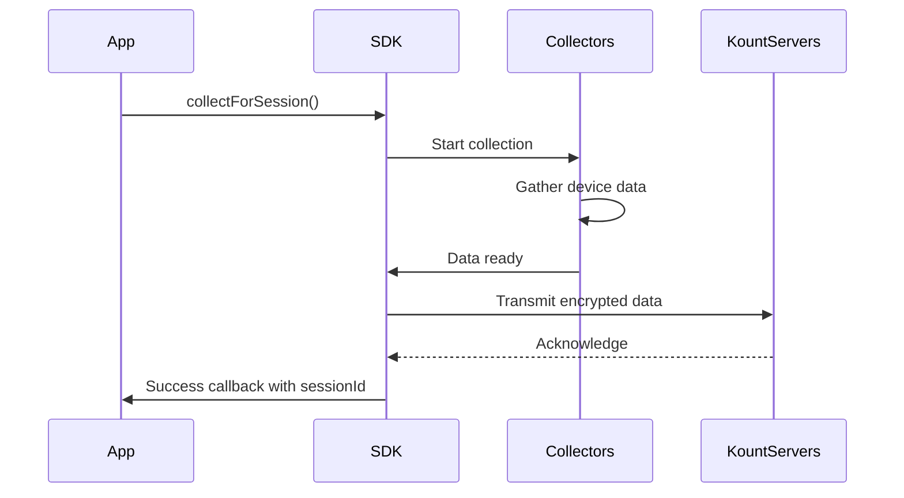

The Kount Android SDK collects device data to create a unique fingerprint of each device, enabling accurate fraud detection and risk assessment. This process, known as Device Data Collection (DDC), happens automatically when you call `collectForSession()`.

## What is Device Fingerprinting?

Device fingerprinting is the process of collecting various data points from a device to create a unique identifier. This fingerprint helps Kount's fraud detection system:

- Identify returning devices across different sessions
- Detect suspicious patterns and anomalies
- Assess risk levels for transactions
- Distinguish between legitimate users and fraudsters

<Note>
The device fingerprint is **not** based on personally identifiable information (PII). It uses technical device characteristics that are privacy-safe.
</Note>

## Data Categories

The SDK collects data from several categories to build a comprehensive device profile:

<CardGroup cols={2}>
  <Card title="Hardware Information" icon="microchip">
    - Device model and manufacturer
    - Screen resolution and density
    - Available sensors
    - CPU architecture
    - Memory specifications
  </Card>
  
  <Card title="Software Information" icon="code">
    - Android OS version
    - Installed app packages (if available)
    - System fonts and languages
    - Browser user agent
    - Time zone and locale settings
  </Card>
  
  <Card title="Network Information" icon="wifi">
    - IP address
    - Network type (WiFi, cellular, etc.)
    - Connection characteristics
    - Network operator information
  </Card>
  
  <Card title="Location Information" icon="location-dot">
    - GPS coordinates (if permission granted)
    - City-level location data
    - Time zone offset
  </Card>
</CardGroup>

<Info>
The SDK automatically adapts data collection based on Android version and available permissions. On devices without location permissions, for example, the SDK still collects all other data points.
</Info>

## Collection Process

Here's how data collection works:



### Collection Lifecycle

<Steps>
  <Step title="Initialization">
    When you call `collectForSession()`, the SDK initializes all data collectors based on your configuration and available permissions.
  </Step>
  
  <Step title="Data Gathering">
    Multiple collectors run in parallel to gather device information efficiently. This process typically takes 1-3 seconds depending on device capabilities.
  </Step>
  
  <Step title="Data Transmission">
    Collected data is encrypted and transmitted to Kount's servers. The SDK uses secure HTTPS connections to protect data in transit.
  </Step>
  
  <Step title="Completion">
    Once transmission is complete, your success callback is invoked with a unique session ID. This session ID links the collected data to your transaction.
  </Step>
</Steps>

## Privacy Considerations

Kount takes privacy seriously and follows industry best practices:

<AccordionGroup>
  <Accordion title="No PII Collection" icon="shield-check">
    The SDK does **not** collect:
    - User names or email addresses
    - Phone numbers or contact lists
    - Photos, files, or media
    - Passwords or authentication tokens
    - Messages or communication content
    - Precise GPS coordinates without explicit permission
  </Accordion>
  
  <Accordion title="Data Encryption" icon="lock">
    All data transmitted from the device is encrypted using industry-standard TLS/SSL protocols. Data at rest on Kount's servers is also encrypted.
  </Accordion>
  
  <Accordion title="Compliance" icon="certificate">
    The SDK is designed to comply with:
    - GDPR (General Data Protection Regulation)
    - CCPA (California Consumer Privacy Act)
    - PCI DSS requirements
    - Android's privacy guidelines
  </Accordion>
  
  <Accordion title="User Consent" icon="hand">
    For location data collection, the SDK respects Android's permission system. You must request and obtain user consent for `ACCESS_FINE_LOCATION` permission. See the [Permission Handling guide](/guides/permissions) for details.
  </Accordion>
</AccordionGroup>

## Collection Timing

When should you trigger data collection?

<Tip>
**Best Practice**: Call `collectForSession()` as early as possible in your user flow, but not before the user performs a meaningful action.
</Tip>

### Recommended Timing Scenarios

| Scenario | When to Collect | Example |
|----------|----------------|----------|
| **E-commerce** | When user views checkout page | After adding items to cart, before payment |
| **Account Creation** | When signup form is displayed | Before user submits registration |
| **Login** | When login screen loads | Before authentication attempt |
| **In-App Purchases** | When purchase flow starts | Before displaying payment options |
| **High-Risk Actions** | Before sensitive operations | Money transfer, password change, etc. |

<Warning>
**Don't collect too early**: Collecting data on app launch may waste resources if the user never performs a transaction. 

**Don't collect too late**: Collecting after a transaction is submitted means you can't prevent fraud in real-time.
</Warning>

## Collection Performance

The SDK is optimized for minimal performance impact:

- **Asynchronous**: All collection happens on background threads
- **Non-blocking**: Your UI remains responsive during collection
- **Efficient**: Typical collection completes in 1-3 seconds
- **Battery-friendly**: Minimal battery consumption
- **Network-optimized**: Small payload size (typically < 50KB)

### Enhanced Data Collection

Starting with version 4.0.0, the SDK includes enhanced data collection capabilities:

```kotlin
// The SDK automatically uses enhanced collectors on Android 10+
KountSDK.collectForSession(
    this,
    { sessionId ->
        // On Android 10+ devices, this includes:
        // - City-level location information
        // - Enhanced timing metrics
        // - Additional device signals
        Log.d("Kount", "Enhanced collection completed: $sessionId")
    },
    { sessionId, error ->
        Log.e("Kount", "Collection failed: $error")
    }
)
```

<Info>
Features are automatically enabled based on the device's Android version. You don't need to write version-specific code—the SDK handles it for you.
</Info>

## Monitoring Collection Status

You can check the collection status at any time:

```kotlin
val status = KountSDK.getCollectionStatus()

when (status) {
    "IDLE" -> Log.d("Kount", "No collection in progress")
    "COLLECTING" -> Log.d("Kount", "Collection in progress")
    "COMPLETED" -> Log.d("Kount", "Collection completed successfully")
    "FAILED" -> Log.d("Kount", "Collection failed")
}
```

See the [KountSDK.getCollectionStatus()](/api/kount-sdk#getcollectionstatus) API reference for details.

## Next Steps

<CardGroup cols={2}>
  <Card title="Session Management" icon="fingerprint" href="/concepts/session-management">
    Learn how session IDs work and how to use them
  </Card>
  
  <Card title="Permission Handling" icon="shield-check" href="/guides/permissions">
    Implement location permissions for enhanced collection
  </Card>
  
  <Card title="Analytics Collection" icon="chart-line" href="/concepts/analytics">
    Enable optional behavioral analytics
  </Card>
  
  <Card title="API Reference" icon="code" href="/api/kount-sdk">
    Explore the complete SDK API
  </Card>
</CardGroup>
