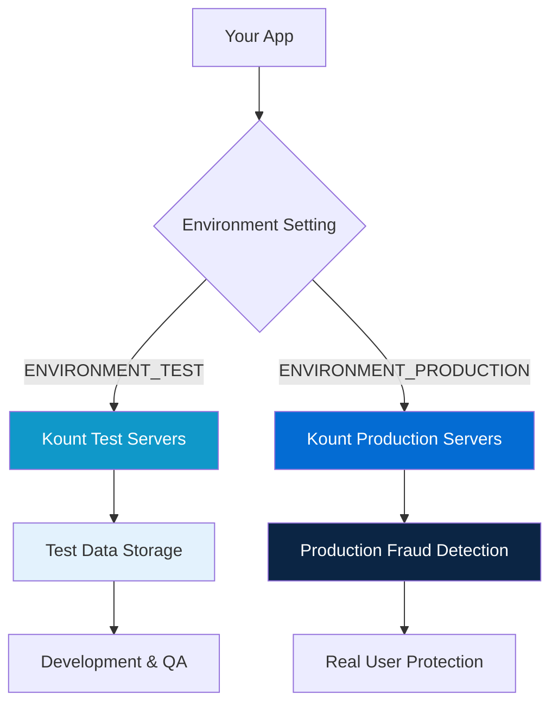

The Kount SDK supports two environments: **Test** and **Production**. Using the correct environment ensures your data goes to the right place during development and after launch.

<Warning>
**Critical**: Always use `ENVIRONMENT_TEST` during development and testing. Switch to `ENVIRONMENT_PRODUCTION` only when deploying to production.
</Warning>

## Environment Overview

Kount provides separate environments to isolate development activity from real production data:

<CardGroup cols={2}>
  <Card title="Test Environment" icon="flask">
    **Purpose**: Development, testing, and integration
    
    - Safe for experimentation
    - No impact on production fraud detection
    - Uses test servers and test data
    - Free to use during integration
  </Card>
  
  <Card title="Production Environment" icon="building">
    **Purpose**: Live applications with real users
    
    - Processes real fraud detection
    - Affects your Kount billing
    - Uses production servers
    - Requires valid merchant credentials
  </Card>
</CardGroup>



## Setting the Environment

Configure the environment during SDK initialization, before calling `collectForSession()`:

### Test Environment (Default for Development)

```kotlin
import com.kount.api.KountSDK

class MainActivity : AppCompatActivity() {
    override fun onCreate(savedInstanceState: Bundle?) {
        super.onCreate(savedInstanceState)
        
        KountSDK.setMerchantId("999999")
        
        // Set to TEST environment
        KountSDK.setEnvironment(KountSDK.ENVIRONMENT_TEST)
        
        // Safe to experiment
        KountSDK.collectForSession(this, { sessionId ->
            Log.d("Kount", "Test collection: $sessionId")
        }, { _, error -> 
            Log.e("Kount", "Error: $error")
        })
    }
}
```

### Production Environment (For Live Apps)

```kotlin
import com.kount.api.KountSDK

class MainActivity : AppCompatActivity() {
    override fun onCreate(savedInstanceState: Bundle?) {
        super.onCreate(savedInstanceState)
        
        KountSDK.setMerchantId("YOUR_PRODUCTION_MERCHANT_ID")
        
        // Set to PRODUCTION environment
        KountSDK.setEnvironment(KountSDK.ENVIRONMENT_PRODUCTION)
        
        // Production data collection
        KountSDK.collectForSession(this, { sessionId ->
            Log.d("Kount", "Production collection: $sessionId")
        }, { _, error -> 
            Log.e("Kount", "Error: $error")
        })
    }
}
```

### Java Example

```java
import com.kount.api.KountSDK;

public class MainActivity extends AppCompatActivity {
    @Override
    protected void onCreate(Bundle savedInstanceState) {
        super.onCreate(savedInstanceState);
        
        KountSDK.INSTANCE.setMerchantId("999999");
        
        // For development: TEST
        KountSDK.INSTANCE.setEnvironment(KountSDK.ENVIRONMENT_TEST);
        
        // For production: PRODUCTION
        // KountSDK.INSTANCE.setEnvironment(KountSDK.ENVIRONMENT_PRODUCTION);
    }
}
```

<Tip>
**Development tip**: Use build variants or build config fields to automatically switch environments based on your build type:

```kotlin
val environment = if (BuildConfig.DEBUG) {
    KountSDK.ENVIRONMENT_TEST
} else {
    KountSDK.ENVIRONMENT_PRODUCTION
}

KountSDK.setEnvironment(environment)
```
</Tip>

## Environment Constants

The SDK provides two environment constants:

| Constant | Value | Purpose |
|----------|-------|----------|
| `KountSDK.ENVIRONMENT_TEST` | `0` | Development, QA, and testing |
| `KountSDK.ENVIRONMENT_PRODUCTION` | `1` | Live production applications |

<Note>
These are integer constants. Don't use string values or custom numbers—always use the SDK-provided constants.
</Note>

## When to Use Each Environment

<Tabs>
  <Tab title="Test Environment">
    Use `ENVIRONMENT_TEST` in these scenarios:
    
    <Steps>
      <Step title="Initial Integration">
        When first integrating the SDK into your app. Test that data collection works without affecting production.
        
        ```kotlin
        KountSDK.setEnvironment(KountSDK.ENVIRONMENT_TEST)
        ```
      </Step>
      
      <Step title="Local Development">
        During feature development on your local machine or emulator.
      </Step>
      
      <Step title="QA Testing">
        When your QA team tests the app before release. This includes:
        - Manual testing
        - Automated UI tests
        - Integration tests
      </Step>
      
      <Step title="Beta Releases">
        For beta builds distributed to testers (TestFlight, Firebase App Distribution, etc.).
      </Step>
      
      <Step title="Staging Environments">
        If you have a staging server, use TEST environment to match your staging backend.
      </Step>
    </Steps>
    
    <Info>
    Test environment data is separate from production and won't affect your fraud detection models or billing.
    </Info>
  </Tab>
  
  <Tab title="Production Environment">
    Use `ENVIRONMENT_PRODUCTION` only for:
    
    <Steps>
      <Step title="Production Releases">
        Apps distributed through Google Play Store or other production channels to real users.
        
        ```kotlin
        KountSDK.setEnvironment(KountSDK.ENVIRONMENT_PRODUCTION)
        ```
      </Step>
      
      <Step title="Real Transactions">
        When users perform actual transactions that require fraud detection.
      </Step>
      
      <Step title="Live User Data">
        Any scenario where real user data needs fraud assessment.
      </Step>
    </Steps>
    
    <Warning>
    Production collections count toward your Kount billing. Only use this environment for actual production deployments.
    </Warning>
  </Tab>
</Tabs>

## Build Configuration Patterns

Automate environment switching using Android build configurations:

### Using Build Types

```gradle build.gradle
android {
    buildTypes {
        debug {
            buildConfigField "boolean", "KOUNT_USE_PRODUCTION", "false"
        }
        release {
            buildConfigField "boolean", "KOUNT_USE_PRODUCTION", "true"
        }
    }
}
```

Then in your code:

```kotlin
class Application : Application() {
    override fun onCreate() {
        super.onCreate()
        
        val environment = if (BuildConfig.KOUNT_USE_PRODUCTION) {
            KountSDK.ENVIRONMENT_PRODUCTION
        } else {
            KountSDK.ENVIRONMENT_TEST
        }
        
        KountSDK.setEnvironment(environment)
    }
}
```

### Using Product Flavors

```gradle build.gradle
android {
    flavorDimensions "environment"
    
    productFlavors {
        dev {
            dimension "environment"
            buildConfigField "int", "KOUNT_ENVIRONMENT", "0" // TEST
        }
        prod {
            dimension "environment"
            buildConfigField "int", "KOUNT_ENVIRONMENT", "1" // PRODUCTION
        }
    }
}
```

In your code:

```kotlin
KountSDK.setEnvironment(BuildConfig.KOUNT_ENVIRONMENT)
```

### Using Remote Config

For maximum flexibility, use Firebase Remote Config or a similar service:

```kotlin
class Application : Application() {
    override fun onCreate() {
        super.onCreate()
        
        // Fetch from Remote Config
        val useProduction = RemoteConfig.getBoolean("kount_use_production")
        
        val environment = if (useProduction) {
            KountSDK.ENVIRONMENT_PRODUCTION
        } else {
            KountSDK.ENVIRONMENT_TEST
        }
        
        KountSDK.setEnvironment(environment)
    }
}
```

<Warning>
**Security note**: Never hard-code production merchant IDs or environment settings in your code. Use build configurations or secure remote config.
</Warning>

## Displaying Current Environment

It's helpful to display the current environment in your UI during development:

```kotlin
class DebugActivity : AppCompatActivity() {
    override fun onCreate(savedInstanceState: Bundle?) {
        super.onCreate(savedInstanceState)
        
        val environmentText = findViewById<TextView>(R.id.environment)
        
        // Display current environment
        val env = when (getCurrentEnvironment()) {
            KountSDK.ENVIRONMENT_TEST -> "Test"
            KountSDK.ENVIRONMENT_PRODUCTION -> "Production"
            else -> "Unknown"
        }
        
        environmentText.text = "Kount Environment: $env"
        
        // Add visual warning for production
        if (getCurrentEnvironment() == KountSDK.ENVIRONMENT_PRODUCTION) {
            environmentText.setTextColor(Color.RED)
            environmentText.setTypeface(null, Typeface.BOLD)
        }
    }
    
    private fun getCurrentEnvironment(): Int {
        // Query SDK configuration
        return KountSDK.getEnvironment() // Hypothetical method
    }
}
```

<Tip>
Add a visual indicator in debug builds to remind developers which environment is active:

```kotlin
if (BuildConfig.DEBUG) {
    val badge = when (environment) {
        KountSDK.ENVIRONMENT_TEST -> "[TEST]"
        KountSDK.ENVIRONMENT_PRODUCTION -> "[PROD]"
        else -> ""
    }
    supportActionBar?.title = "$badge ${supportActionBar?.title}"
}
```
</Tip>

## Environment Differences

Understand how the two environments differ:

<AccordionGroup>
  <Accordion title="Server Endpoints" icon="server">
    Test and production environments use different server URLs. The SDK handles this automatically—you don't need to configure endpoints manually.
    
    <Info>
    Version 4.3.1 updated the QA environment URL. Always use the latest SDK version for correct endpoint routing.
    </Info>
  </Accordion>
  
  <Accordion title="Data Isolation" icon="database">
    Data collected in test environment is completely separate from production:
    
    - Test session IDs only work with test backend queries
    - Production session IDs only work with production queries
    - No cross-environment data sharing
    
    <Warning>
    Don't mix environments: If you collect data in TEST, your backend must query the test environment.
    </Warning>
  </Accordion>
  
  <Accordion title="Merchant IDs" icon="id-card">
    You may have different merchant IDs for test and production:
    
    ```kotlin
    val merchantId = if (BuildConfig.DEBUG) {
        "999999" // Test merchant ID
    } else {
        "YOUR_PROD_ID" // Production merchant ID
    }
    
    KountSDK.setMerchantId(merchantId)
    ```
  </Accordion>
  
  <Accordion title="Billing" icon="credit-card">
    - **Test**: Free, no billing impact
    - **Production**: Counts toward your Kount subscription
  </Accordion>
  
  <Accordion title="Performance" icon="gauge">
    Both environments have similar performance characteristics. Test servers may occasionally be slower during Kount's internal testing.
  </Accordion>
</AccordionGroup>

## Migration from Test to Production

When you're ready to launch:

<Steps>
  <Step title="Verify Test Integration">
    Ensure your test integration works perfectly:
    
    ```kotlin
    KountSDK.setEnvironment(KountSDK.ENVIRONMENT_TEST)
    KountSDK.collectForSession(this, { sessionId ->
        assert(sessionId.isNotEmpty())
    }, { _, _ -> })
    ```
  </Step>
  
  <Step title="Update Configuration">
    Change environment constant and merchant ID:
    
    ```kotlin
    // Before (Test)
    KountSDK.setMerchantId("999999")
    KountSDK.setEnvironment(KountSDK.ENVIRONMENT_TEST)
    
    // After (Production)
    KountSDK.setMerchantId("YOUR_PRODUCTION_MERCHANT_ID")
    KountSDK.setEnvironment(KountSDK.ENVIRONMENT_PRODUCTION)
    ```
  </Step>
  
  <Step title="Update Backend">
    Ensure your backend queries the production environment:
    
    ```python
    # Update backend configuration
    kount_client = KountClient(
        merchant_id="YOUR_PRODUCTION_MERCHANT_ID",
        environment="production"  # Changed from "test"
    )
    ```
  </Step>
  
  <Step title="Test Production Build">
    Build a production APK/AAB and test on a real device before releasing:
    
    ```bash
    ./gradlew assembleRelease
    ```
  </Step>
  
  <Step title="Monitor First Collections">
    After release, monitor logs to confirm production collections succeed:
    
    ```kotlin
    KountSDK.collectForSession(this, { sessionId ->
        // Log to analytics service
        analytics.logEvent("kount_collection_success", mapOf(
            "environment" to "production",
            "sessionId" to sessionId
        ))
    }, { _, error -> 
        // Alert on production failures
        crashlytics.log("Kount production failure: $error")
    })
    ```
  </Step>
</Steps>

## Common Mistakes

<Warning>
**Mistake #1**: Using production environment during development

```kotlin
// Wrong: This will count toward billing
KountSDK.setEnvironment(KountSDK.ENVIRONMENT_PRODUCTION)
// During development...
```

**Solution**: Always use TEST during development.
</Warning>

<Warning>
**Mistake #2**: Forgetting to switch to production for release

```kotlin
// Wrong: Production app using test environment
KountSDK.setEnvironment(KountSDK.ENVIRONMENT_TEST)
// In Google Play release...
```

**Solution**: Use build configurations to automatically switch environments.
</Warning>

<Warning>
**Mistake #3**: Mixing environments between app and backend

```kotlin
// App: Using TEST
KountSDK.setEnvironment(KountSDK.ENVIRONMENT_TEST)

// Backend: Querying PRODUCTION
kount_client.inquire(environment="production", session_id=sessionId)
// This won't work!
```

**Solution**: Keep app and backend environments in sync.
</Warning>

<Warning>
**Mistake #4**: Using magic numbers instead of constants

```kotlin
// Wrong: Hard-coded environment value
KountSDK.setEnvironment(1)

// Correct: Use SDK constants
KountSDK.setEnvironment(KountSDK.ENVIRONMENT_PRODUCTION)
```
</Warning>

## Troubleshooting

<AccordionGroup>
  <Accordion title="Session not found in backend" icon="magnifying-glass">
    **Symptom**: Backend says session ID doesn't exist.
    
    **Cause**: App and backend are using different environments.
    
    **Solution**: Verify both app and backend use the same environment (both TEST or both PRODUCTION).
  </Accordion>
  
  <Accordion title="Unexpected billing charges" icon="credit-card">
    **Symptom**: Charged for test collections.
    
    **Cause**: Accidentally using PRODUCTION environment in debug builds.
    
    **Solution**: Review build configuration and ensure debug builds use ENVIRONMENT_TEST.
  </Accordion>
  
  <Accordion title="Environment not switching" icon="rotate">
    **Symptom**: Environment change doesn't take effect.
    
    **Cause**: Calling `setEnvironment()` after `collectForSession()` has already started.
    
    **Solution**: Always call `setEnvironment()` during app initialization, before any collection calls.
  </Accordion>
</AccordionGroup>

## Best Practices Summary

<CardGroup cols={2}>
  <Card title="Use Build Configs" icon="code-branch">
    Automate environment switching with build types and flavors. Never manually change environments.
  </Card>
  
  <Card title="Verify Before Release" icon="check-double">
    Always test production builds before submitting to Play Store. Confirm production environment is active.
  </Card>
  
  <Card title="Keep Environments Synced" icon="arrows-rotate">
    Ensure app and backend use matching environments. Document your environment configuration.
  </Card>
  
  <Card title="Monitor Production" icon="chart-line">
    Log environment and collection status in production. Set up alerts for failures.
  </Card>
</CardGroup>

## Next Steps

<CardGroup cols={2}>
  <Card title="Configuration Guide" icon="gear" href="/guides/configuration">
    Complete SDK configuration reference
  </Card>
  
  <Card title="Backend Integration" icon="server" href="/concepts/session-management">
    Learn how to query Kount's API from your backend
  </Card>
  
  <Card title="Build Configurations" icon="hammer" href="/installation">
    Set up build variants for automatic environment switching
  </Card>
  
  <Card title="API Reference" icon="code" href="/api/kount-sdk">
    Explore the complete SDK API
  </Card>
</CardGroup>
