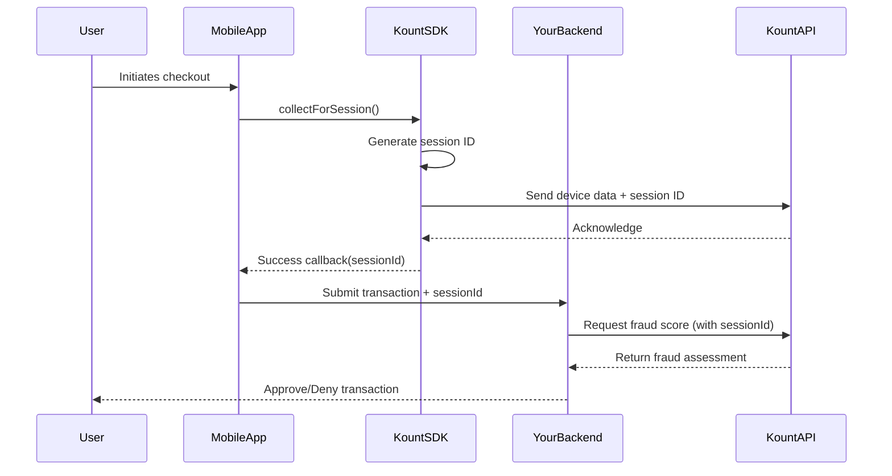

Session IDs are the key to linking device data collected by the Kount SDK with transactions in your backend system. Every data collection event generates a unique session ID that you pass to your server for fraud analysis.

## What is a Session ID?

A session ID is a unique identifier generated by the Kount SDK that represents a single data collection event. Think of it as a "receipt" that proves device data was collected for a specific user interaction.

<Note>
Session IDs are **automatically generated** by the SDK. You don't need to create them manually.
</Note>

### Session ID Format

Session IDs follow a specific format validated by the SDK:

```
Example: a1b2c3d4e5f6g7h8i9j0k1l2m3n4o5p6
```

- Alphanumeric string (letters and numbers)
- Typically 32 characters long
- Unique for each collection event
- Case-sensitive

<Info>
Starting with version 4.3.1, the SDK includes improved regex validation and auto-generation for session IDs. If you pass `null` or an empty string to `collectForSession()`, the SDK automatically generates a valid ID.
</Info>

## How Session IDs Work

Here's the complete flow of how session IDs connect your app to Kount's fraud detection:



### The Session Workflow

<Steps>
  <Step title="Collection Starts">
    When you call `collectForSession()`, the SDK generates a new session ID and begins collecting device data.
    
    ```kotlin
    KountSDK.collectForSession(
        this,
        { sessionId ->
            // Use this sessionId
        },
        { sessionId, error ->
            // Handle error
        }
    )
    ```
  </Step>
  
  <Step title="Data is Transmitted">
    The SDK sends the collected device data to Kount's servers along with the session ID. This happens automatically in the background.
  </Step>
  
  <Step title="Session ID is Returned">
    Once collection completes, your success callback receives the session ID. Store this ID—you'll need it for your backend.
    
    ```kotlin
    var currentSessionId: String? = null
    
    KountSDK.collectForSession(this, { sessionId ->
        currentSessionId = sessionId
        Log.d("Kount", "Session ID: $sessionId")
    }, { sessionId, error ->
        Log.e("Kount", "Failed: $error")
    })
    ```
  </Step>
  
  <Step title="Send to Your Backend">
    When the user submits a transaction (purchase, signup, etc.), include the session ID in your API request.
    
    ```kotlin
    // Example: Submitting a purchase
    val purchaseData = mapOf(
        "amount" to 99.99,
        "currency" to "USD",
        "kountSessionId" to currentSessionId
    )
    
    submitPurchase(purchaseData)
    ```
  </Step>
  
  <Step title="Backend Queries Kount">
    Your backend sends the session ID to Kount's API along with transaction details. Kount returns a fraud risk score based on the device data.
    
    ```python
    # Example: Python backend
    response = kount_client.inquire(
        session_id=request.json['kountSessionId'],
        amount=request.json['amount'],
        # ... other transaction data
    )
    
    if response.risk_score > 70:
        return "DECLINE"
    else:
        return "APPROVE"
    ```
  </Step>
</Steps>

## Retrieving Session IDs

There are two ways to get the current session ID:

### Method 1: From the Callback (Recommended)

The most reliable way is to retrieve the session ID from the success callback:

```kotlin
KountSDK.collectForSession(
    this,
    { sessionId ->
        // Session ID available immediately after collection
        sendToBackend(sessionId)
    },
    { sessionId, error ->
        // Handle failure - you can still get the session ID
        // even if collection partially failed
        Log.e("Kount", "Collection failed but session was $sessionId")
    }
)
```

<Tip>
Even if collection fails, you'll receive a session ID in the failure callback. This allows you to proceed with your transaction and let your backend handle the risk assessment.
</Tip>

### Method 2: Query the SDK Directly

You can also query the current session ID at any time:

```kotlin
val sessionId = KountSDK.getSessionId()
Log.d("Kount", "Current session ID: $sessionId")
```

<Warning>
**Timing matters**: `getSessionId()` returns the most recent session ID. If you call it before `collectForSession()`, it may return `null` or an empty string.
</Warning>

## Session Lifecycle

Understanding when sessions begin and end is important:

<AccordionGroup>
  <Accordion title="Session Creation" icon="play">
    A new session is created every time you call `collectForSession()`. Each call generates a **new, unique** session ID.
    
    ```kotlin
    // First collection
    KountSDK.collectForSession(this, { id1 ->
        Log.d("Kount", "Session 1: $id1")
    }, { _, _ -> })
    
    // Second collection (later in the app)
    KountSDK.collectForSession(this, { id2 ->
        Log.d("Kount", "Session 2: $id2")
        // id1 != id2 (different session IDs)
    }, { _, _ -> })
    ```
  </Accordion>
  
  <Accordion title="Session Duration" icon="clock">
    Sessions don't expire on the client side. Once created, a session ID remains valid until you create a new one. However, Kount's servers may have their own time windows for accepting session data.
    
    <Info>
    Consult your Kount integration documentation for server-side session expiration policies.
    </Info>
  </Accordion>
  
  <Accordion title="Multiple Collections" icon="repeat">
    You can call `collectForSession()` multiple times in your app:
    
    - **Once per transaction**: Most common pattern
    - **Once per screen**: For apps with multiple transaction points
    - **On-demand**: When user performs high-risk actions
    
    Each call creates a new session with a new ID.
  </Accordion>
  
  <Accordion title="Session Persistence" icon="database">
    Session IDs are **not** persisted across app restarts. If the user closes and reopens your app, you should collect a new session.
    
    ```kotlin
    class MainActivity : AppCompatActivity() {
        override fun onCreate(savedInstanceState: Bundle?) {
            super.onCreate(savedInstanceState)
            
            // Collect fresh session on app start
            KountSDK.collectForSession(this, { sessionId ->
                // Store in memory for this session
            }, { _, _ -> })
        }
    }
    ```
  </Accordion>
</AccordionGroup>

## Best Practices

<Card title="One Session Per Transaction" icon="circle-check">
  Create a new session for each transaction or user flow. Don't reuse session IDs across multiple transactions.
  
  ```kotlin
  // Good: New session for each checkout
  fun onCheckoutClicked() {
      KountSDK.collectForSession(this, { sessionId ->
          proceedToPayment(sessionId)
      }, { _, _ -> })
  }
  
  // Bad: Reusing the same session ID
  val globalSessionId = "abc123" // Don't do this!
  ```
</Card>

<Card title="Store Session ID Temporarily" icon="memory">
  Store the session ID in memory (not persistent storage) until your transaction completes.
  
  ```kotlin
  class CheckoutViewModel : ViewModel() {
      private var currentSessionId: String? = null
      
      fun startCheckout() {
          KountSDK.collectForSession(context, { sessionId ->
              currentSessionId = sessionId
          }, { _, _ -> })
      }
      
      fun submitPayment(amount: Double) {
          apiService.purchase(
              amount = amount,
              sessionId = currentSessionId
          )
      }
  }
  ```
</Card>

<Card title="Handle Collection Failures" icon="triangle-exclamation">
  Even if collection fails, your app should continue. Let your backend decide whether to proceed based on the risk score.
  
  ```kotlin
  KountSDK.collectForSession(
      this,
      { sessionId ->
          // Success - proceed with high confidence
          submitTransaction(sessionId, highConfidence = true)
      },
      { sessionId, error ->
          // Failure - proceed with caution
          Log.w("Kount", "Collection failed: $error")
          submitTransaction(sessionId, highConfidence = false)
      }
  )
  ```
</Card>

<Card title="Include in All Risk Events" icon="shield-halved">
  Send the session ID for any event that requires fraud assessment:
  
  - Purchases and payments
  - Account creation
  - Login attempts
  - Password changes
  - Address updates
  - High-value actions
</Card>

## Common Patterns

### E-commerce Checkout

```kotlin
class CheckoutActivity : AppCompatActivity() {
    private var kountSessionId: String? = null
    
    override fun onCreate(savedInstanceState: Bundle?) {
        super.onCreate(savedInstanceState)
        setContentView(R.layout.activity_checkout)
        
        // Collect session when checkout screen loads
        KountSDK.collectForSession(
            this,
            { sessionId ->
                kountSessionId = sessionId
                enablePaymentButton()
            },
            { sessionId, error ->
                kountSessionId = sessionId
                showWarning("Data collection incomplete")
                enablePaymentButton()
            }
        )
    }
    
    fun onPaymentButtonClick() {
        // Include session ID in payment request
        paymentService.processPayment(
            amount = cartTotal,
            kountSessionId = kountSessionId
        )
    }
}
```

### Account Registration

```kotlin
class SignupActivity : AppCompatActivity() {
    
    fun onSignupFormSubmit(email: String, password: String) {
        // Collect session just before signup
        KountSDK.collectForSession(
            this,
            { sessionId ->
                // Submit signup with session ID
                authService.registerUser(
                    email = email,
                    password = password,
                    kountSessionId = sessionId
                )
            },
            { sessionId, error ->
                // Still submit, but with warning
                authService.registerUser(
                    email = email,
                    password = password,
                    kountSessionId = sessionId,
                    lowConfidence = true
                )
            }
        )
    }
}
```

## Troubleshooting

<AccordionGroup>
  <Accordion title="Session ID is null or empty" icon="circle-xmark">
    **Cause**: `getSessionId()` was called before any collection occurred.
    
    **Solution**: Always call `collectForSession()` first, or rely on the callback instead of `getSessionId()`.
  </Accordion>
  
  <Accordion title="Backend says session not found" icon="magnifying-glass">
    **Cause**: The session ID may not have been transmitted to Kount's servers yet, or there was a network failure.
    
    **Solution**: Ensure the success callback completes before submitting to your backend. Add retry logic for network failures.
  </Accordion>
  
  <Accordion title="Same session ID for multiple transactions" icon="copy">
    **Cause**: Reusing the same session ID instead of creating a new one.
    
    **Solution**: Call `collectForSession()` for each transaction to generate a new session ID.
  </Accordion>
  
  <Accordion title="Invalid session ID format" icon="text-slash">
    **Cause**: Manually creating or modifying session IDs (pre-4.3.1 SDK versions).
    
    **Solution**: Always use the session ID provided by the SDK. Upgrade to version 4.3.1+ for improved validation.
  </Accordion>
</AccordionGroup>

## Next Steps

<CardGroup cols={2}>
  <Card title="Data Collection" icon="database" href="/concepts/data-collection">
    Learn what data is collected with each session
  </Card>
  
  <Card title="Integration Examples" icon="code" href="/examples/basic-setup">
    See complete code examples for common scenarios
  </Card>
  
  <Card title="Backend Integration" icon="server" href="/concepts/session-management">
    Learn how to use session IDs in your backend
  </Card>
  
  <Card title="API Reference" icon="book" href="/api/kount-sdk">
    Explore the complete SDK API documentation
  </Card>
</CardGroup>
